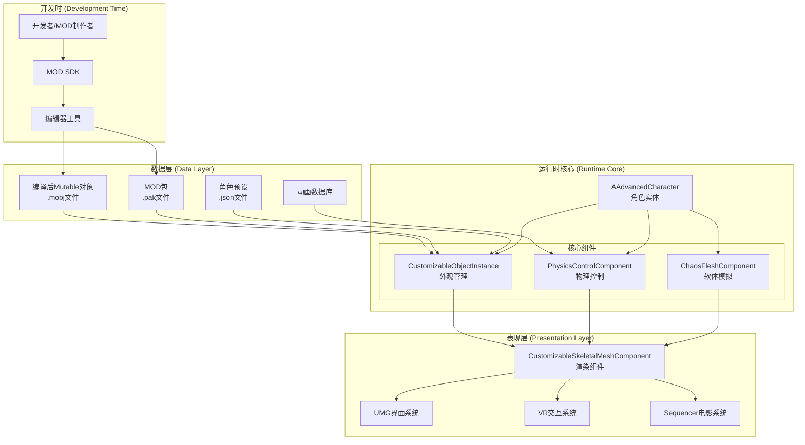
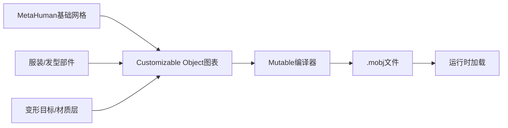
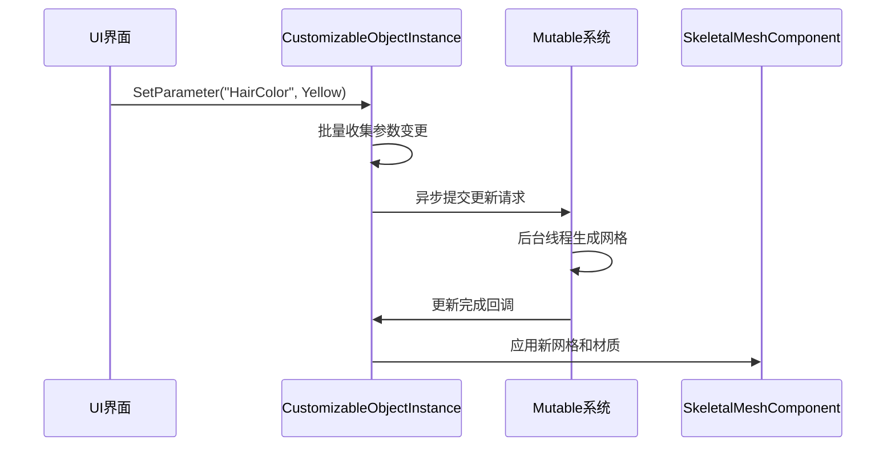
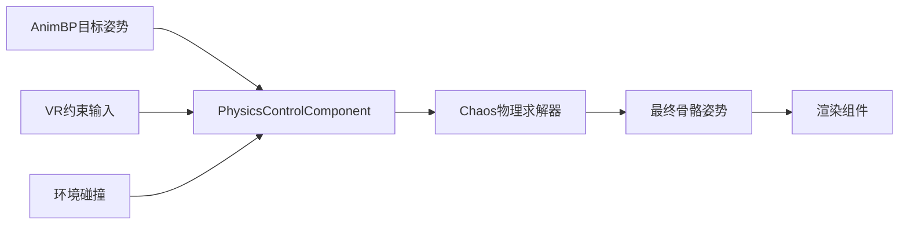
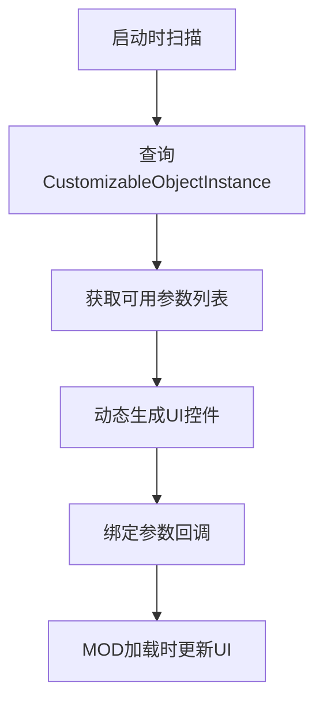
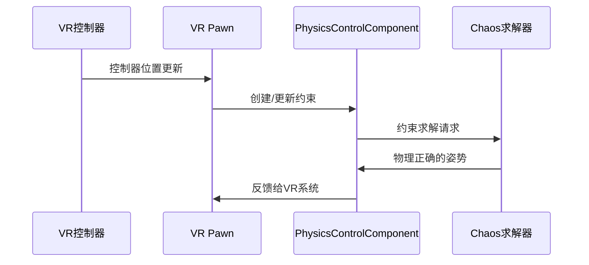
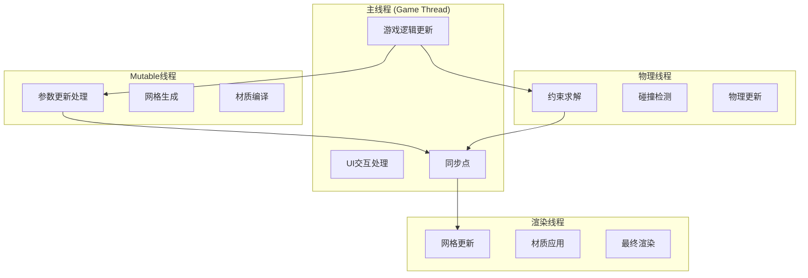
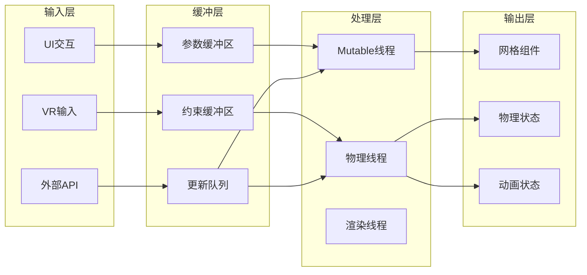

# V4 技术架构：下一代模块化角色系统

## 🎯 愿景概述

基于UE5.6构建下一代Virt-A-Mate，采用分层解耦的系统架构，实现：
- **高性能**: 60FPS+ 稳定运行，支持多角色同屏
- **高稳定性**: 模块化设计，故障隔离，易于调试
- **最大扩展性**: 开放的MOD生态，数据驱动的定制系统

## 🏗️ 架构总览：三层模型

系统采用**数据层 → 运行时核心 → 表现层**的分层架构，确保职责清晰、性能最优：



## 📊 1. 数据层 (Data Layer): 资产的静态基础

数据层是整个系统的基石，负责资产的预处理、存储和分发，为运行时性能奠定基础。

### 🎨 核心资产：Mutable编译对象 (.mobj)

**核心职责**
- 包含角色的完整外观变化空间
- 预编译的高度优化数据库，非传统模型文件
- 支持实时参数化定制

**技术实现流程**


**关键优势**
- ⚡ **性能优化**: 单文件加载替代数百个资产
- 💾 **内存效率**: 按需生成，避免预加载所有变体
- 🔧 **开发友好**: 编辑器内可视化编辑和预览

### 📦 MOD生态：标准化MOD包 (.pak)

**设计理念**
- 统一的MOD分发标准
- 版本控制和依赖管理
- 热插拔支持，无需重启

**包结构定义**
```json
{
  "manifest.json": {
    "mod_id": "unique_mod_identifier",
    "version": "1.0.0",
    "author": "ModAuthor",
    "dependencies": ["base_game:1.0.0"],
    "provides": {
      "clothing": ["shirt_casual", "pants_jeans"],
      "morphs": ["muscle_definition"],
      "materials": ["skin_tan", "hair_blonde"]
    },
    "compatibility": {
      "min_game_version": "1.0.0",
      "max_game_version": "2.0.0"
    }
  }
}
```

**技术要求**
- 🎯 **Mutable集成**: 必须包含Mutable Child Object
- ⚙️ **物理兼容**: 配套的Physics Asset定义
- 🔒 **安全验证**: 数字签名和完整性检查

**动态加载机制**
```cpp
// MOD加载流程伪代码
class UModManager
{
    void ScanAndMountMods()
    {
        // 1. 扫描Mods文件夹
        // 2. 解析manifest.json
        // 3. 验证依赖关系
        // 4. 按优先级挂载.pak文件
        // 5. 更新可用定制选项
    }
};
```

## ⚙️ 2. 运行时核心 (Runtime Core): 角色的动态生命周期

运行时核心是系统的心脏，负责角色从生成到每帧交互的完整生命周期管理。

### 🏛️ 核心架构：AAdvancedCharacter

**设计理念**
- 组件化架构，职责分离
- 统一的生命周期管理
- 高性能的数据流协调

```cpp
// AAdvancedCharacter 核心结构
class AAdvancedCharacter : public APawn
{
protected:
    // 核心组件
    UPROPERTY(VisibleAnywhere, BlueprintReadOnly)
    class UCustomizableObjectInstance* AppearanceInstance;

    UPROPERTY(VisibleAnywhere, BlueprintReadOnly)
    class UPhysicsControlComponent* PhysicsControl;

    UPROPERTY(VisibleAnywhere, BlueprintReadOnly)
    class UChaosFleshComponent* SoftBodySimulation;

    // 性能管理
    UPROPERTY(EditAnywhere, BlueprintReadWrite)
    ECharacterLOD CurrentLOD = ECharacterLOD::High;

public:
    // 统一的更新协调
    virtual void Tick(float DeltaTime) override;

    // 性能自适应
    void UpdateLODBasedOnDistance(float DistanceToPlayer);
};
```

### 🎨 外观管理：CustomizableObjectInstance

**核心职责**
- 角色外观参数的实时管理
- 异步Mutable更新协调
- 内存效率优化

**数据流设计**


**性能优化特性**
- 📦 **批量更新**: 合并多个参数变更
- 🔄 **异步处理**: 避免主线程阻塞
- 💾 **内存池**: 重用网格数据对象

### ⚡ 物理控制：PhysicsControlComponent

**设计目标**
- 动画与物理的无缝融合
- VR交互的精确响应
- 高性能的约束求解

**每帧数据流**


**关键技术特性**
- 🎯 **肌肉力模拟**: 智能驱动力计算
- 🤝 **约束管理**: 动态VR交互约束
- 🔄 **物理LOD**: 基于距离的精度调整

### 🥩 软体模拟：ChaosFleshComponent

**应用场景**
- 胸部、臀部等软体部位
- 面部表情的细节变形
- 服装的动态褶皱

**技术实现**
```cpp
// ChaosFleshComponent 核心逻辑
class UChaosFleshComponent : public UMeshComponent
{
    // 软体属性配置
    UPROPERTY(EditAnywhere)
    float Elasticity = 0.8f;

    UPROPERTY(EditAnywhere)
    float Damping = 0.1f;

    // 每帧更新
    void UpdateSoftBodyDeformation(float DeltaTime)
    {
        // 1. 获取骨骼运动数据
        // 2. 计算惯性力和外力
        // 3. 应用软体物理解算
        // 4. 更新顶点位置
    }
};
```

**性能考虑**
- 🎚️ **LOD系统**: 距离相关的模拟精度
- 🧵 **多线程**: 并行的顶点计算
- 📊 **自适应**: 基于性能预算的动态调整

## 🎭 3. 表现层 (Presentation Layer): 用户体验界面

表现层是用户直接接触的界面，负责最终渲染和交互体验的呈现。

### 🖼️ 渲染系统：CustomizableSkeletalMeshComponent

**技术特性**
- 继承自UE5标准骨骼网格组件
- 专门优化用于Mutable动态网格
- 支持实时LOD和遮挡剔除

```cpp
// 渲染组件核心功能
class UCustomizableSkeletalMeshComponent : public USkeletalMeshComponent
{
public:
    // Mutable网格应用
    void ApplyMutableMesh(USkeletalMesh* GeneratedMesh);

    // 性能优化
    void UpdateLODBasedOnScreenSize();

    // 材质动态切换
    void ApplyDynamicMaterials(const TArray<UMaterialInterface*>& Materials);
};
```

### 🎛️ UI系统：数据驱动的UMG界面

**设计原则**
- 完全数据驱动，零硬编码
- 自动适配MOD新增选项
- 响应式布局，支持多分辨率

**动态UI生成流程**


**核心UI组件**
```cpp
// 动态参数UI生成器
class UDynamicParameterWidget : public UUserWidget
{
    // 根据参数类型生成对应控件
    void GenerateParameterControls(const TArray<FMutableParameter>& Parameters);

    // 滑块类型
    USlider* CreateFloatSlider(const FMutableFloatParameter& Param);

    // 颜色选择器
    UColorPicker* CreateColorPicker(const FMutableColorParameter& Param);

    // 选项列表
    UComboBox* CreateOptionSelector(const FMutableOptionParameter& Param);
};
```

### 🥽 VR交互系统：物理驱动的沉浸体验

**交互理念**
- 基于物理约束的自然交互
- 避免传统IK的不自然感
- 支持复杂的多点接触

**VR交互数据流**


**技术实现**
```cpp
// VR交互管理器
class AVRInteractionPawn : public APawn
{
    // 约束管理
    void CreateHandConstraint(EControllerHand Hand, FVector WorldPosition);
    void UpdateConstraintStrength(float Strength);
    void ReleaseConstraint(EControllerHand Hand);

    // 触觉反馈
    void SendHapticFeedback(float Intensity, float Duration);
};
```

## 🚀 架构优势总结

### 🔧 模块化解耦
```
外观系统 (Mutable) ⟷ 物理系统 (Physics Control) ⟷ 动画系统 (AnimBP)
     ↕                        ↕                           ↕
独立开发/测试            独立性能调优                独立内容创作
```

**优势体现**
- 🎯 **职责清晰**: 每个模块专注自己的领域
- 🔄 **独立迭代**: 模块可以独立升级和优化
- 🐛 **故障隔离**: 一个模块的问题不会影响其他模块

### ⚡ 高性能架构

**性能保障机制**
- 📊 **智能LOD**: 基于距离和重要性的动态精度调整
- 🧵 **多线程**: Mutable、物理、渲染的并行处理
- 💾 **内存优化**: 对象池和智能缓存机制
- 🎯 **性能预算**: 自适应的质量调整

### 🌐 超强扩展性

**MOD生态支持**
- 📦 **标准化**: 统一的MOD包格式和API
- 🔌 **热插拔**: 运行时加载/卸载MOD
- 🔒 **安全性**: 沙盒化的MOD执行环境
- 📈 **版本管理**: 完善的依赖和兼容性系统

### 🎮 次世代体验

**技术优势**
- 🎨 **视觉品质**: 充分利用UE5的Nanite和Lumen
- ⚡ **物理真实感**: Chaos Physics的高精度模拟
- 🥽 **VR沉浸**: 基于物理的自然交互
- 🎬 **内容创作**: Sequencer集成的电影级制作工具

## 🗺️ 开发路线图

基于V4架构的分阶段实施计划，确保每个阶段都有可交付的成果和明确的验收标准。

### 🎯 第一阶段：核心基础 (4-6周)

**目标**: 建立系统的核心骨架，验证架构可行性

#### 核心任务
- [ ] **AAdvancedCharacter基础类**
  - 实现组件容器和生命周期管理
  - 添加基础的LOD系统
  - 集成性能监控接口

- [ ] **CustomizableObjectInstance包装器**
  - 封装Mutable API调用
  - 实现参数批量更新机制
  - 添加异步更新支持

- [ ] **PhysicsControlComponent集成**
  - 基础物理控制功能
  - 动画与物理的融合
  - 简单的约束系统

- [ ] **数据流管道验证**
  - 组件间通信机制
  - 性能基准测试
  - 内存使用分析

#### 验收标准
- ✅ 能够创建基础角色实体
- ✅ 支持简单的外观参数修改
- ✅ 物理与动画正常融合
- ✅ 帧率稳定在60FPS以上

### 🔧 第二阶段：资产管道 (3-4周)

**目标**: 建立完整的资产制作和加载流程

#### 核心任务
- [ ] **.mobj编译流程**
  - 编辑器工具集成
  - 自动化编译管道
  - 版本控制支持

- [ ] **MOD包系统**
  - .pak文件格式定义
  - manifest.json标准
  - 动态加载机制

- [ ] **动态UI生成**
  - 参数驱动的界面生成
  - MOD选项自动集成
  - 响应式布局系统

#### 验收标准
- ✅ 能够编译和加载.mobj文件
- ✅ MOD包可以正常加载和卸载
- ✅ UI能够自动适配新的参数

### 🚀 第三阶段：高级功能 (4-5周)

**目标**: 实现系统的高级特性和优化

#### 核心任务
- [ ] **ChaosFleshComponent集成**
  - 软体物理模拟
  - 性能优化和LOD
  - 与主物理系统的集成

- [ ] **VR交互系统**
  - 基于约束的交互
  - 触觉反馈系统
  - 多点接触支持

- [ ] **性能优化**
  - 多线程处理管道
  - 内存池系统
  - 自适应质量调整

#### 验收标准
- ✅ 软体物理效果自然流畅
- ✅ VR交互响应及时准确
- ✅ 支持多角色同屏渲染

### 🌟 第四阶段：生态系统 (3-4周)

**目标**: 建立完整的开发和社区生态

#### 核心任务
- [ ] **MOD SDK开发**
  - 可视化MOD编辑器
  - 自动化打包工具
  - 调试和测试工具

- [ ] **社区工具链**
  - 在线MOD分享平台
  - 版本管理系统
  - 用户反馈机制

- [ ] **文档和教程**
  - 完整的API文档
  - 视频教程系列
  - 最佳实践指南

#### 验收标准
- ✅ 社区开发者能够独立制作MOD
- ✅ 完整的文档和教程体系
- ✅ 稳定的MOD分享生态

---

## � 性能优化策略

### 📊 智能LOD系统

**多层次LOD设计**
```cpp
// 统一的LOD级别定义
enum class ECharacterLOD : uint8
{
    Ultra,      // 全物理 + 软体 + 高精度Mutable (VR近距离)
    High,       // 全物理 + 简化软体 (主要交互角色)
    Medium,     // 简化物理 + 无软体 (背景角色)
    Low,        // 仅动画 + 静态网格 (远距离角色)
    Culled      // 完全禁用 (不可见或极远距离)
};

// 智能LOD管理器
class UCharacterLODManager
{
    // 基于多因素的LOD计算
    ECharacterLOD CalculateOptimalLOD(
        float DistanceToPlayer,
        bool bIsInVRInteraction,
        bool bIsVisible,
        float CurrentFrameTime
    );

    // 平滑LOD过渡
    void TransitionToLOD(ECharacterLOD TargetLOD, float TransitionTime = 0.5f);
};
```

**LOD切换策略**
- 🎯 **距离驱动**: 基于与玩家的距离
- �️ **可见性检测**: 屏幕外角色降级
- 🤝 **交互优先**: 正在交互的角色保持高LOD
- ⚡ **性能自适应**: 帧率下降时自动降级

### 🧵 多线程优化架构

**并行处理管道**


**线程安全机制**
```cpp
// 线程安全的参数更新队列
class UThreadSafeParameterQueue
{
    mutable FCriticalSection QueueMutex;
    TQueue<FParameterUpdate> PendingUpdates;

public:
    void EnqueueUpdate(const FParameterUpdate& Update);
    bool DequeueUpdate(FParameterUpdate& OutUpdate);
    void ProcessAllUpdates();
};
```

### 💾 内存管理优化

**对象池系统**
```cpp
// 统一的对象池管理器
template<typename T>
class TObjectPool
{
    TArray<TUniquePtr<T>> AvailableObjects;
    TArray<T*> UsedObjects;

public:
    T* Acquire()
    {
        if (AvailableObjects.Num() > 0)
        {
            auto Object = AvailableObjects.Pop().Release();
            UsedObjects.Add(Object);
            return Object;
        }
        return CreateNewObject();
    }

    void Release(T* Object)
    {
        UsedObjects.RemoveSingle(Object);
        Object->Reset(); // 重置对象状态
        AvailableObjects.Add(TUniquePtr<T>(Object));
    }
};

// 专用的网格数据池
using FMeshDataPool = TObjectPool<USkeletalMesh>;
using FMaterialPool = TObjectPool<UMaterialInstanceDynamic>;
```

**内存优化策略**
- 🔄 **对象重用**: 避免频繁的内存分配/释放
- 📦 **预分配**: 启动时预分配常用对象
- 🧹 **智能清理**: 定期清理未使用的内存
- 📊 **内存监控**: 实时监控内存使用情况

### ⚡ 批量更新系统

**参数更新优化**
```cpp
// 智能批量更新管理器
class UParameterBatchManager
{
    struct FBatchedUpdate
    {
        TMap<FString, float> FloatParams;
        TMap<FString, FLinearColor> ColorParams;
        TMap<FString, bool> BoolParams;
        float BatchStartTime = 0.0f;
        bool bIsPending = false;
    };

    FBatchedUpdate CurrentBatch;
    float BatchTimeout = 0.1f; // 100ms批量窗口

public:
    // 添加参数到当前批次
    void AddParameterUpdate(const FString& ParamName, float Value);

    // 强制提交当前批次
    void FlushBatch();

    // 每帧检查是否需要提交
    void Tick(float DeltaTime);
};
```

**预测性更新**
```cpp
// UI响应性优化
class UPredictiveUpdateSystem
{
    // 本地预测缓存
    TMap<FString, float> PredictedValues;

    // 立即应用预测值到UI
    void ApplyPredictedValue(const FString& ParamName, float Value);

    // 当真实更新完成时同步
    void SyncWithActualUpdate(const FString& ParamName, float ActualValue);
};
```

### 🔄 数据流优化

**优化后的数据流架构**


**关键优化点**
- 🔄 **异步管道**: 避免主线程阻塞
- 📊 **数据共享**: 组件间共享计算结果
- 🎯 **增量更新**: 只更新变化的部分
- 💾 **智能缓存**: 重用计算结果

### 📦 MOD系统优化

**懒加载MOD管理器**
```cpp
// 高效的MOD管理系统
class UAdvancedModManager
{
    // MOD元数据缓存
    struct FModMetadata
    {
        FString ModID;
        FString Version;
        TArray<FString> Dependencies;
        TSet<FString> ProvidedFeatures;
        bool bIsLoaded = false;
        float LoadPriority = 1.0f;
        FDateTime LastUsed;
    };

    TMap<FString, FModMetadata> ModRegistry;
    TSet<FString> LoadedMods;

public:
    // 智能加载策略
    void LoadModOnDemand(const FString& ModID);
    void PreloadFrequentMods();
    void UnloadUnusedMods();

    // 依赖管理
    bool ValidateDependencies(const FString& ModID);
    TArray<FString> ResolveDependencyOrder(const TArray<FString>& ModIDs);
};
```

**MOD兼容性系统**
```cpp
// 版本兼容性检查
class UModCompatibilityChecker
{
    struct FCompatibilityRule
    {
        FString ModID;
        FString MinVersion;
        FString MaxVersion;
        TArray<FString> ConflictsWith;
    };

public:
    bool CheckCompatibility(const TArray<FString>& ActiveMods);
    TArray<FString> GetCompatibilityWarnings();
    bool CanLoadTogether(const FString& ModA, const FString& ModB);
};
```

### 📊 性能监控与自适应系统

**统一性能管理器**
```cpp
class UCharacterPerformanceMonitor : public UGameInstanceSubsystem
{
public:
    struct FPerformanceMetrics
    {
        float MutableUpdateTime = 0.0f;
        float PhysicsUpdateTime = 0.0f;
        float FleshUpdateTime = 0.0f;
        float TotalFrameTime = 0.0f;
        int32 ActiveCharacterCount = 0;
        float MemoryUsageMB = 0.0f;
    };

private:
    FPerformanceMetrics CurrentMetrics;
    float TargetFrameTime = 16.67f; // 60 FPS

public:
    // 性能自适应
    void AutoOptimizePerformance();

    // 预算管理
    void SetPerformanceBudget(float TargetFrameTime);

    // 实时调整
    void AdjustLODBasedOnPerformance();

    // 性能报告
    FPerformanceMetrics GetCurrentMetrics() const { return CurrentMetrics; }
};
```

**自适应策略**
- 📈 **性能预算**: 设定目标帧时间，自动调整LOD
- 🎛️ **动态调节**: 实时监控，智能降级/升级
- 📊 **性能分析**: 详细的性能指标收集
- � **预警系统**: 性能问题提前预警

---

## 🎯 总结与展望

### � 架构核心价值

V4技术架构通过**分层解耦**、**性能优化**和**生态开放**三大核心理念，构建了一个面向未来的模块化角色系统：

#### 🔧 技术优势
- **模块化设计**: 数据层、运行时核心、表现层职责清晰
- **高性能架构**: 智能LOD、多线程、内存优化确保流畅体验
- **扩展性**: 开放的MOD生态和数据驱动的定制系统

#### � 预期成果
- **性能提升**: 60FPS+稳定运行，支持多角色同屏
- **开发效率**: 模块化开发，快速迭代和调试
- **社区生态**: 繁荣的MOD生态，持续的内容创新

### 🚀 实施策略

**分阶段推进**
1. **基础架构** → 核心组件和数据流
2. **性能优化** → LOD系统和多线程
3. **生态建设** → MOD系统和开发工具
4. **社区支持** → 文档、教程和SDK

**风险控制**
- 渐进式重构，保持向后兼容
- 充分的性能基准测试
- 及时的社区反馈收集

### 🌟 技术创新点

- **智能LOD系统**: 多因素驱动的性能自适应
- **预测性更新**: UI交互的即时响应
- **约束驱动物理**: VR交互的自然体验
- **懒加载MOD**: 高效的资源管理

### 📈 长期愿景

V4架构不仅是技术升级，更是为下一代虚拟角色交互体验奠定基础。通过开放的生态系统和强大的技术架构，我们将：

- 🎮 **重新定义虚拟角色交互标准**
- 🌐 **建立繁荣的创作者生态**
- � **推动VR/AR技术在角色模拟领域的应用**
- 🔬 **为未来的AI驱动角色系统做好准备**

---

*这份架构文档将随着开发进展持续更新，确保技术方案与实际需求保持同步。*
